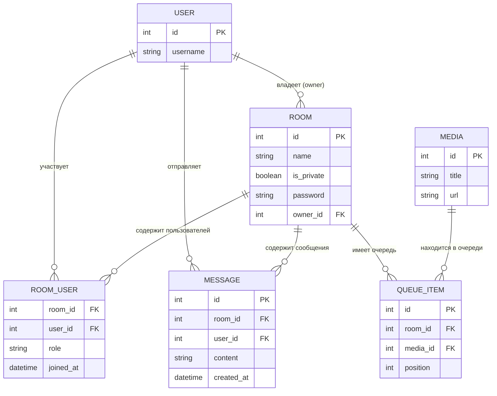
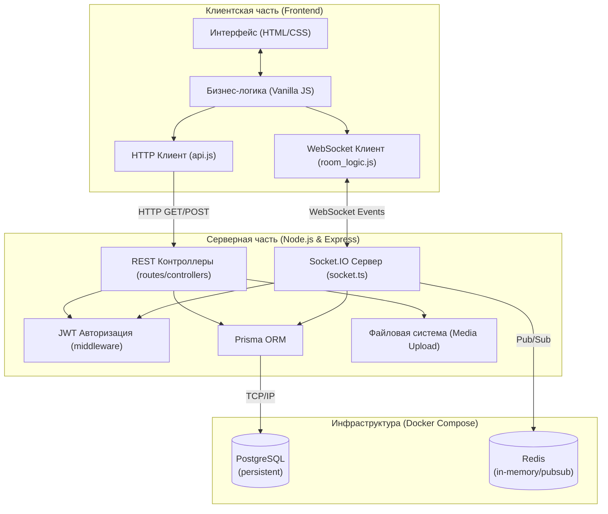

# Архитектура проекта CoMedia

В данном документе представлены базовые архитектурные схемы проекта, отражающие модель данных и физическое распределение компонентов.

## 1. Схема Базы Данных (Entity-Relationship Diagram)

Схема отображает структуру хранения данных в PostgreSQL, настроенную через Prisma ORM:

## 2. Общая Архитектура Уровня Подсистем (Component Diagram)

Диаграмма демонстрирует логическое распределение модулей приложения и характер их взаимодействия между клиентом, сервером и инфраструктурой.

